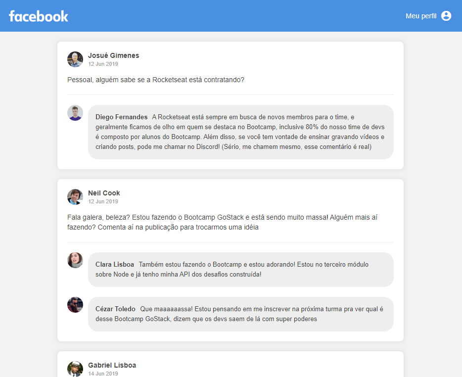

# Desafio para Certificação Bootcamp - GoStack 8.0 da Rocketseat.

## Desafio 04. Introdução ao React

Criando uma aplicação do zero utilizando **Webpack, Babel, Webpack Dev Server e ReactJS**.

Nessa aplicação foi desenvolvido uma **interface** semelhante com a do **Facebook** utilizando React.

As informações contidas na interface são **estáticas** e não reflete API REST ou back-end.

## Tela da aplicação



### Componentes

Na imagem abaixo está destaco cada componente com as responsabilidades de cada um:


**Header (Amarelo):** Responsável por exibir a logo e o link para acessar o perfil;

**PostList (Verde):** Responsável por armazenar os dados da listagem de post, esses dados devem ficar dentro do `state` do componente e não em uma variável comum, por exemplo:

```js
class PostList extends Component {
  state = {
    posts: [
      {
        id: 1,
        author: {
          name: 'Julio Alcantara',
          avatar: 'http://url-da-imagem.com/imagem.jpg'
        },
        date: '04 Jun 2019',
        content: 'Pessoal, alguém sabe se a Rocketseat está contratando?',
        comments: [
          {
            id: 1,
            author: {
              name: 'Diego Fernandes',
              avatar: 'http://url-da-imagem.com/imagem.jpg'
            },
            content: "Conteúdo do comentário"
          }
        ],
      },
      {
        id: 2,
        // Restante dos dados de um novo post
      }
    ]
  };
}
```

**Post (Vermelho):** Responsável por exibir os dados do post, esses dados estão vindo através de uma propriedade recebida do componente PostList, ou seja, lá no PostList obtenho algo assim:

```js
posts.map(post => <Post key={post.id} data={post} />)
```

**Comment (Azul):** Responsável por exibir um comentário. Os dados do comentário estão vindo por uma propriedade do componente. Dentro do componente Post tenho um novo `.map` para listar os comentários do post:

```js
data.comments.map(comment => <Comment key={comment.id} data={comment} />)
```